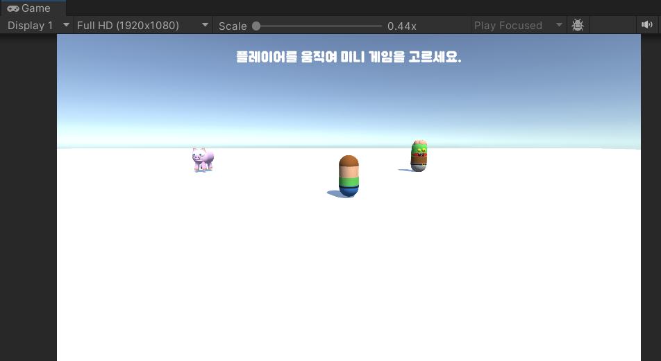

# README

# 1. 게임 소개

- **장르**: 미니게임 (현재는 미로만 구현)
- **컨셉:** 플레이어는 여러 미니게임을 플레이할 수 있는 공간에서 시작한다. 그곳에서 각 오브젝트와 부딪히면 해당 오브젝트가 나오는 미니게임이 시작된다.
- **조작법:**
    - **플레이어 이동**: `WASD`
    - **카메라 회전**: `마우스 위치`
    - **점프**: `스페이스바`
- **유니티 버전: `2022.3.f1`**
- 📅 **작업기간: `2023.10.06, 2023.10.11 (이틀)`**
    - `**2023.10.06 (금)**`
        - 📝 **기획** - 기능 명세서 작성
    - `**2023.10.11 (수)**`
        - 💻 **기능 구현**
            - 오브젝트와 충돌 시 씬 이동
            - 미로 맵 자동 생성
            - InputSystem을 통한 플레이어 이동

# 2. 핵심 기능 소개

### 0️⃣ 오브젝트와 충돌 시 씬 이동

| 관련 코드 | https://github.com/jungbosong/3DMiniGame/blob/c19c28d2e11439085a8b58b2d11353a144fbcfc0/Assets/Scripts/Characters/Zombie.cs#L7-L21 |

**🔽 `LobbyScene` 실행 화면**

로비씬에서 플레이어를 움직여 좀비와 충돌하면 미로 게임이 시작된다.

### 1️⃣ 미로 맵 자동 생성

| 관련 코드 | https://github.com/jungbosong/3DMiniGame/blob/c19c28d2e11439085a8b58b2d11353a144fbcfc0/Assets/Scripts/MazeGenerator.cs#L6-L102 |

**🔽 MapGenerator 오브젝트 인스펙터 정보**

**🔽 실행 결과 화면**

